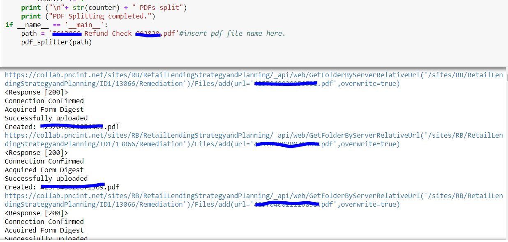

# Python_PDF_Splitter
 Automates splitting of PDF files into separate custom named files. Uploads automatically to Sharepoint utilizing the Microsoft Sharepoint API. Below is the output showing the Sharepoint API site connection with the PDF files being uploaded. 
 
 
